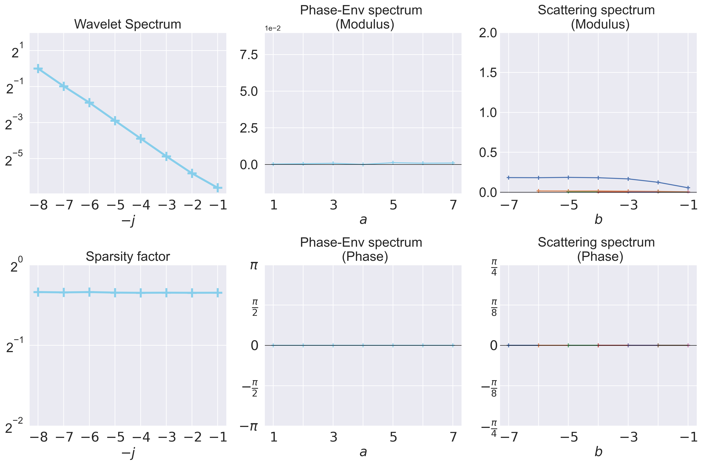

# Scattering covariance

This repository implements the *Scattering Covariance* introduced in [1].

It provides an interpretable low-dimensional representation of multi-scale time-series.

The main application of *Scattering Covariance* is time-series **analysis** and time-series **generation**.

Among other applications are the assessment of **self-similarity** in the data and the detection of **non-Gaussianity**.

## Installation

Run the commands below to install the required packages.

```bash
pip install git+https://github.com/RudyMorel/scattering_covariance
```

## Analysis

The *Scattering Covariance* provides a dashboard used to analyze multi-scale time-series.

Standard model of time series can be loaded using **load_data** from `frontend.py`. The function **analyze** computes *Scattering Covariance*, it can be visualized using the function **plot_dashboard**.

```python
from scatcov.frontend import (analyze, generate, load_data,
                              plot_dashboard)

# DATA
x = load_data(process_name='fbm', R=128, T=8192, H=0.5)  # a B x T array

# ANALYSIS
Rx = analyze(x, J=8, high_freq=0.25)  # a DescribedTensor

# VISUALIZATION
plot_dashboard(Rx)
```

It can be used to quantify non-Gaussianity and discriminate models such as fBm, MRW, SMRW:

```python
# DATA
x1 = load_data(process_name='fbm', R=256, T=32768)
x2 = load_data(process_name='mrw', R=256, T=32768, lam=0.1)
x3 = load_data(process_name='smrw', R=256, T=32768, lam=0.1,
               gamma=1/32768/256, K=0.07, alpha=0.23, beta=0.23)

# ANALYSIS
Rx1 = analyze(x1, J=8, high_freq=0.25, cuda=True, nchunks=64)
Rx2 = analyze(x2, J=8, high_freq=0.25, cuda=True, nchunks=64)
Rx3 = analyze(x3, J=8, high_freq=0.25, cuda=True, nchunks=64)

# VISUALIZATION
plot_dashboard([Rx1, Rx2, Rx3], labels=['fbm', 'mrw', 'smrw'])
```


## Generation

A model of the process $X$ can be defined from the *Scattering Covariance*. Such model can be sampled using gradient descent [1].

Function **generate** from `frontend.py` takes observed data $X$ as input and return realizations of our model of $X$.

```python
# DATA
x = load_data(process_name='smrw', R=1, T=4096, lam=0.3,
              gamma=1/4096/256, K=0.03, alpha=0.23, beta=0.23) # a B x T array

# GENERATION
x_gen = generate(x, J=9, S=1, it=1000, cuda=True, tol_optim=1e-3) # a S x T array

# VISUALIZATION
fig, axes = plt.subplots(2,1, figsize=(10,5))
axes[0].plot(np.diff(x)[0,0,:], color='lightskyblue', linewidth=0.5)
axes[1].plot(np.diff(x_gen)[0,0,:], color='coral', linewidth=0.5)
axes[0].set_ylim(-3,3)
axes[1].set_ylim(-3,3)
```


[1] "Scale Dependencies and Self-Similarity Through Wavelet Scattering Covariance"

Rudy Morel et al. - https://arxiv.org/abs/2204.10177
