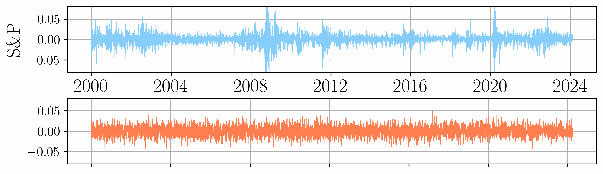
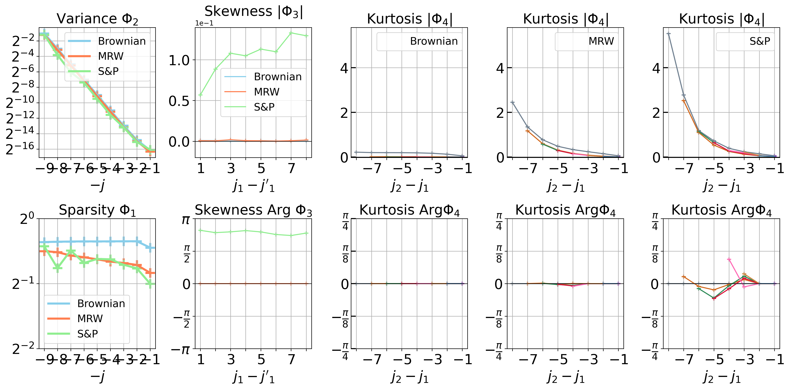
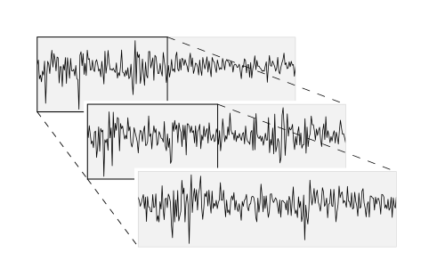
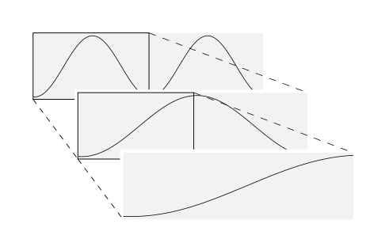
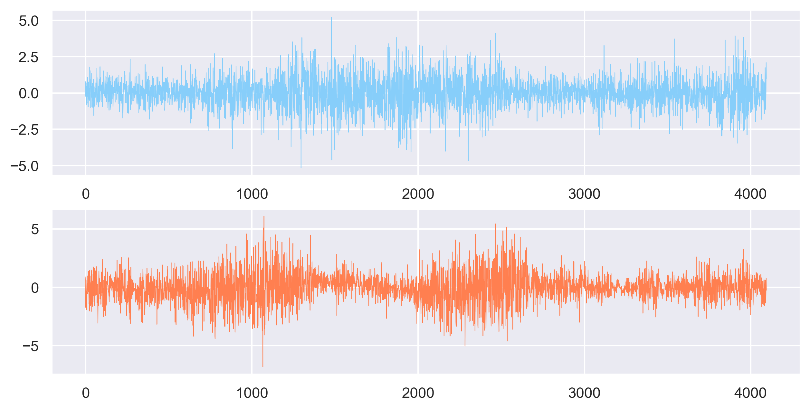

# Scattering Spectra

The Scattering Spectra [1] are a set of statistics that provide an interpretable low-dimensional representation of multi-scale time-series.

They can be used for time-series **analysis** and **generation**, but also to assess **self-similarity** in the data as well as to detect **non-Gaussianity**.

For a quick start, see `tutorial.ipynb`

<p align="center">
    
</p>
<p align="center">
    <b>Generation of S&P log-returns in a Scattering Spectra model.</b>
</p>

## Installation

From a venv with python>=3.10 run the commands below to install the required packages.

```bash
pip install git+https://github.com/RudyMorel/scattering_spectra
```

## 1. Analysis

The *Scattering Spectra* provide a dashboard to analyze time-series.

Standard model of time series can be loaded using **load_data** from `frontend.py`. The function **analyze** computes the *Scattering Spectra*, they can be visualized using the function **plot_dashboard**.

```python
from scatspectra import load_data, SPDaily, analyze, plot_dashboard

# DATA
x_brownian = load_data(name='fbm', R=256, T=6063, H=0.5)
x_mrw = load_data(name='mrw', R=256, T=6063, H=0.5, lam=0.2)
x_snp = SPDaily().lnx  # S&P500 daily prices from 2000 to 2024

# ANALYSIS
scat_brownian = analyze(x_brownian)
scat_mrw = analyze(x_mrw)
scat_snp = analyze(x_snp)

# VISUALIZATION
plot_dashboard([scat_brownian, scat_mrw, scat_snp], labels=['Brownian', 'MRW', 'S&P']);
```



The dashboard consists of 4 spectra that can be interpreted as follows:

- $\Phi_1(x)[j]$ are the sparsity factors. The lower these coefficients the sparser the signal $x$.
- $\Phi_2(x)[j]$ is the standard wavelet spectrum. A steep curve indicates long-range dependencies.
- $\Phi_3(x)[a]$ is the phase-modulus cross-spectrum. 
  - $|\Phi_3(x)[a]|$ is zero if the underlying process is invariant to sign change $x \overset{d}{=}-x$. \
    These coefficients quantify non-invariance to sign-change often called "skewness".
  - Arg $\Phi_3(x)[a]$ is zero if the underlying process $x$ is time-symmetric: $x(t) \overset{d}{=}x(-t)$. 
    These coefficients quantify time-asymmetry. They are typically non-zero for processes with time-causality.
- $\Phi_4(x)[a,b]$ is the modulus cross-spectrum. 
  - $|\Phi_4(x)[a,b]|$ quantify envelope dependencies. Steep curves indicate long-range dependencies.
  - Arg $\Phi_4(x)[a,b]$ quantify envelope time-asymmetry. These coefficients are typically non-zero for processes with time-causality.

For further interpretation see [1].

### Self-Similarity

| Self-Similar                                                                                      | Not Self-Similar                                                                                           |
|:-------------------------------------------------------------------------------------------------:|:----------------------------------------------------------------------------------------------------------:|
|  *Self-similarity distance: 2.1* |  *Self-similarity distance: 22.0* |

Processes encountered in Finance, Seismology, Physics may exhibit a form of regularity called self-similarity. Also refered as scale invariance, it states that the process is similar at different scales. 
Assessing such property on a single realization is a hard problem. 


Similarly to time-stationarity that has a wide-sense definition that can be tested statistically on the covariance of a process $x(t)$, we introduced in [1] a wide-sense definition of self-similarity called **wide-sense Self-Similarity**. It can be tested on a covariance matrix across times $t,t'$ and scales $j,j'$.

The function **self_simi_obstruction_score** from `frontend.py` assesses self-similarity on a time-series.

## 2. Generation

A model of the process $x$ can be defined from the *Scattering Spectra*. Such model can be sampled using gradient descent [1].

Function **generate** from `frontend.py` takes observed data $x$ as input and return realizations of our model of $x$.

```python
from scatspectra import generate

# DATA
snp_data = SPDaily()

# GENERATION
gen_data = generate(snp_data, cuda=CUDA, tol_optim=6e-3)

# VISUALIZATION
fig, axes = plt.subplots(2, 1, figsize=(10, 4))
axes[0].plot(snp_data.dlnx[0, 0, :], color="lightskyblue", linewidth=0.5)
axes[1].plot(gen_data.dlnx[0, 0, :], color="coral", linewidth=0.5)
axes[0].set_ylim(-0.1, 0.1)
axes[1].set_ylim(-0.1, 0.1)
```



See `tutorial.ipynb` and `testing.ipynb` for more code examples. 


[1] "Scale Dependencies and Self-Similar Models with Wavelet Scattering Spectra"

Rudy Morel et al. - https://arxiv.org/abs/2204.10177
