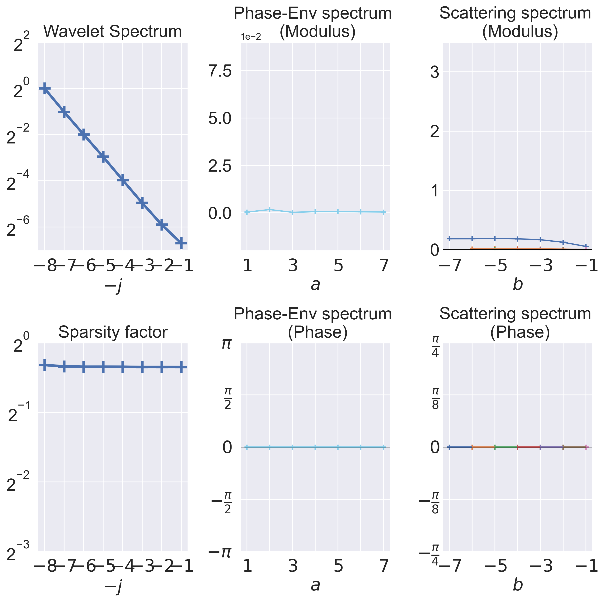

# Scattering covariance

This repository implements the *Scattering Covariance* introduced in [1].

It provides an interpretable low-dimensional representation of multi-scale time-series. 

The main application of *Scattering Covariance* is time-series **analysis** and time-series **generation**. 

Among other applications are the assessment of **self-similarity** in the data and the detection of **non-Gaussianity**. 

## Analysis

The *Scattering Covariance* provides a dashboard used to analyze multi-scale time-series.

Standard model of time series can be loaded using **load_data** from `frontend.py`. The function **analyze** computes *Scattering Covariance*, it can be visualized using the function **plot_dashboard**. 

```python
# DATA
X = load_data(name='fbm', R=128, T=8192, H=0.5)  # a R x T array

# ANALYSIS
RX = analyze(X, J=8, high_freq=0.25, moments='cov')  # a DescribedTensor

# VISUALIZATION
plot_dashboard(RX)
```

It can be used to discriminate models such as fBm, MRW, SMRW:

```python
# DATA
X1 = load_data(name='fbm', R=128, T=32768)
X2 = load_data(name='mrw', R=128, T=32768, lam=0.1)
X3 = load_data(name='smrw', R=128, T=32768, lam=0.1, 
               gamma=1/T/256, K=0.07, alpha=0.23, beta=0.23)

# ANALYSIS
RX1 = analyze(X1, J=8, high_freq=0.25, moments='cov', cuda=True)
RX2 = analyze(X2, J=8, high_freq=0.25, moments='cov', cuda=True)
RX3 = analyze(X3, J=8, high_freq=0.25, moments='cov', cuda=True)

# VISUALIZATION
plot_dashboard([RX1, RX2, RX3])
```


## Generation

...

[1] "Scale Dependencies and Self-Similarity Through Wavelet Scattering Covariance"

Rudy Morel et al. - https://arxiv.org/abs/2204.10177
